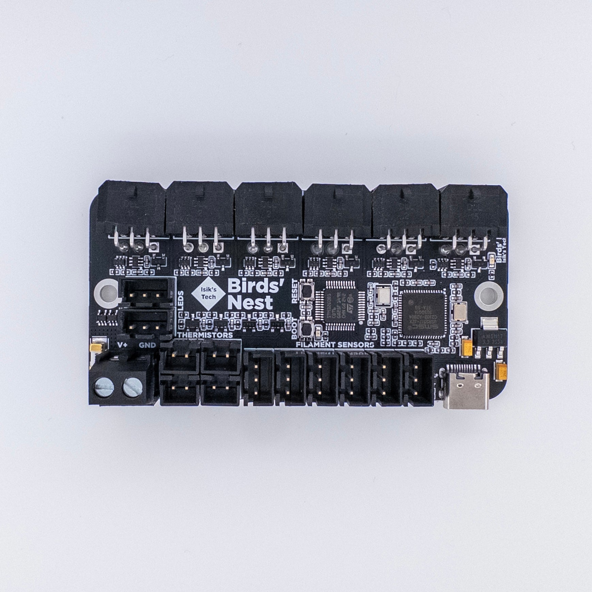

# Birds' Nest Toolchanger USB Hub

Birds' Nest is a USB hub PCB designed for toolchanger printers with USB toolhead PCBs. It features:
- 6x USB Outs for Up To 6 Toolheads, Protected
- 6x Filament Sensor Connectors
- 4x Thermistor Connectors
- 2x 5V RGB Connectors

## Purchasing a Birds' Nest

[Isik's Tech Official Store](https://store.isiks.tech/products/birds-nest)

## Instructions

[Birds' Nest Manual](https://docs.isiks.tech/birds-nest/usb/manual/)

## YouTube

I am a YouTube content creator. If you want content about these projects & more, please consider [subscribing to my YouTube channel](https://www.youtube.com/channel/UClAWYmCkHjsbaX9Wz1df2mg).

## Notes
- Markdown files in this repository may contain Amazon Associate, Aliexpress affiliate, PCBWay affiliate, Jawstec affiliate, Polymaker affiliate links. I make a comission on qualifying purchases.
- This project does not come with any warranty, if you choose to build/use a PCB manufactured using published files in this repository, you are doing this at your own risk!
- If you want to sell PCBs manufactured using published files in this repository, you are allowed to, and you will not owe me any royalties. **You cannot claim that I endorse the sale**. You can check the license file for more information. However, if you **wish** to give me a share you can sponsor me on [GitHub](https://github.com/sponsors/xbst), subscribe on [Patreon](https://l.isiks.tech/patreon) or [YouTube](https://l.isiks.tech/member).
